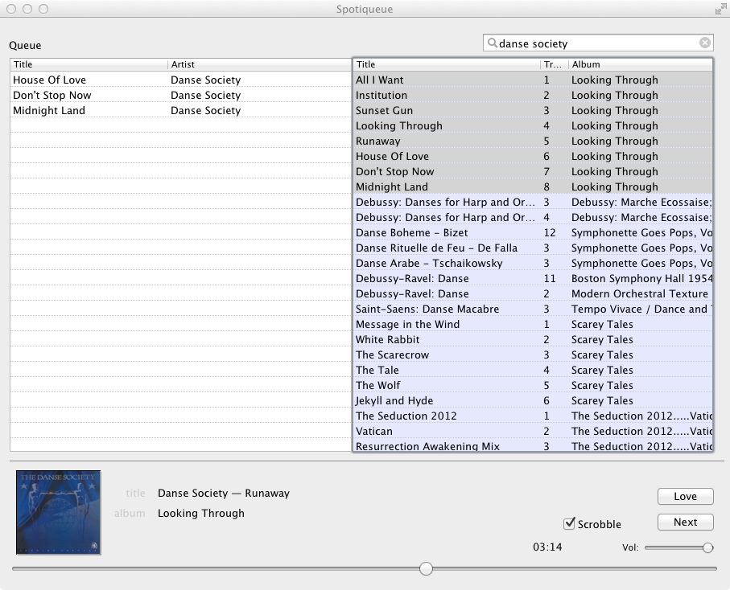

Spotiqueue
==========

A terribly simple Cocoa app for keyboard-based queue-oriented Spotify use. It scrobbles. If you don't want scrobbling, just don't fill in the Last.fm login fields.

Beware of rough edges. Scratches my itch, no other guarantees granted.

Keyboard shortcuts
------------------

* Use arrows to navigate around lists (maybe using shift to select stuff).
* Left and right arrows switch between queue and search results.
* Vim keys (currently only `j`,`k`,`g`,`G`) work.
* Holding the command-key and using the navigation keys moves the selected tracks in the queue.
* Tab cycles through search (`⌘F` or `⌘L`), search results and queue.
* Space bar pauses and unpauses (unless search field has focus).
* Pressing ⏎ (Return) on a single item plays it immediately.
* Pressing ⏎ with multiple songs selected enqueues them (and starts playing, if currently paused).
* `⌘←` enqueues, `⌘⇧←` adds tracks to top of queue.
* `⌘N` skips to the next track. Also useful for starting playback.

Download
--------

If you're the type who prefers deep-frozen pizza and ready-made pasta sauce, you can find a compiled version [here](http://www.denknerd.org/files/Spotiqueue.app.zip). Also interesting for people who just don't happen to be script kiddies.

Future work
-----------

* Save queue across sessions.
* Enable artist / album / related browsing.
* Retrieval of playlists.
* ...feel free to submit requests in the Issues section.
